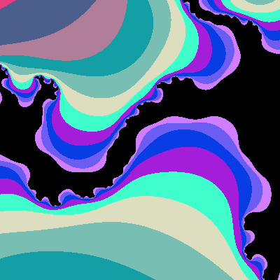
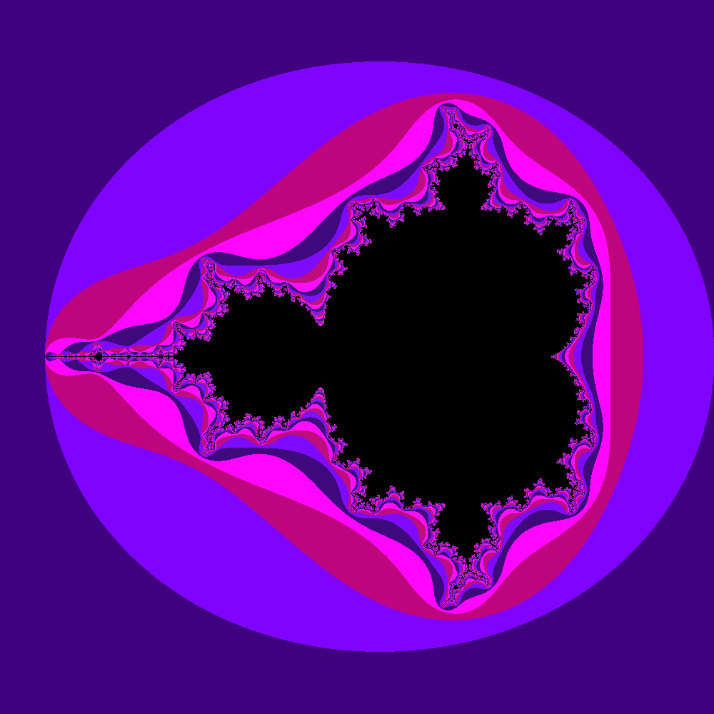
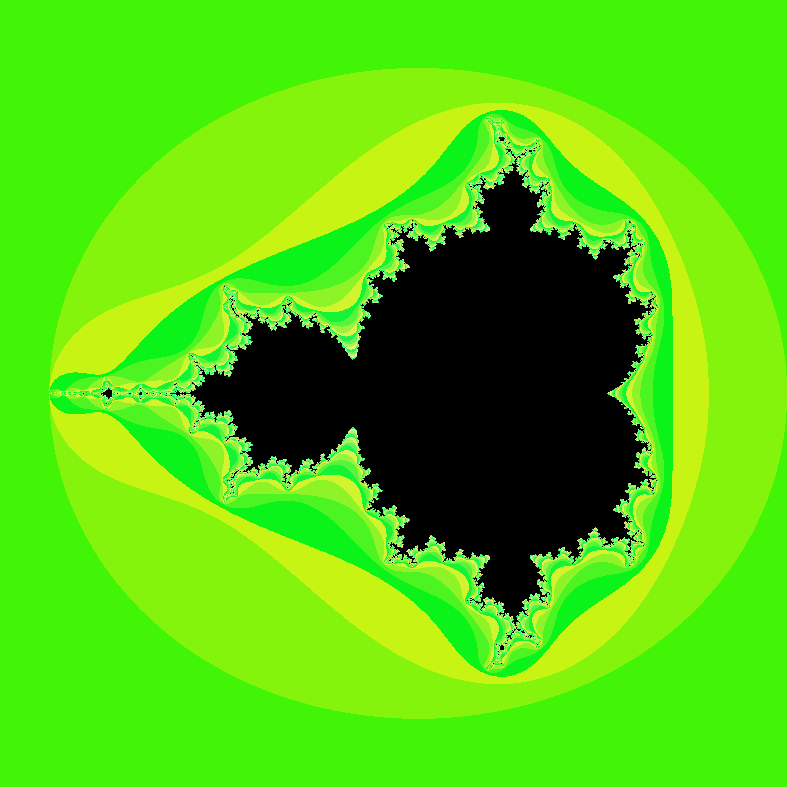
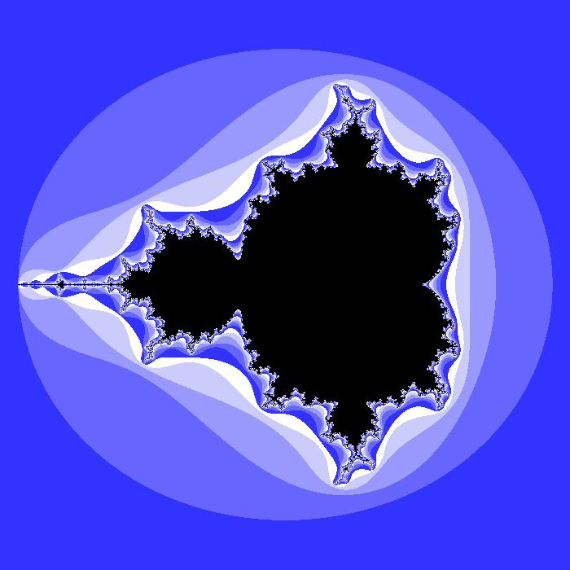
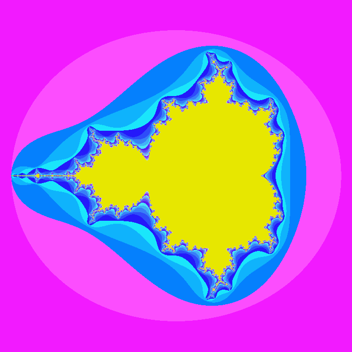

# Mandelbrot Set Visualizer

## How to Run

1. **Install Dependencies**:
   ```bash
   pipenv install --python=3.8
   pipenv shell 
   pip install eel
   pip install pandas 
   pip install pillow 
   ```

2. **Install GCC**:
   - For macOS users, you can use Homebrew:
     ```bash
     brew install gcc
     ```

3. **Navigate to the App Directory**:
   ```bash
   cd app/
   ```

4. **Update Commands in `handlefrontend.py`**:
   Change the two commands in `handlefrontend.py` to the following:
   ```python
   command1 = r'''cd "/Users/amos/Programming/MathPictures/app/" && g++-14 makeimg.cpp -o makeimg -I/opt/homebrew/opt/gmp/include -L/opt/homebrew/opt/gmp/lib -lgmp -lquadmath && "/Users/amos/Programming/MathPictures/app/"makeimg'''
   command2 = """python makeimg.py """ + str(max_iter)
   ```

5. **Run the Frontend**:
   ```bash
   python handlefrontend.py
   ```
   This will open the visualizer in your browser.

## Navigation

To navigate through the Mandelbrot set visualizer, use the arrow keys on your keyboard:
- **Left Arrow (←)**: Go back to the previous view.
- **Up Arrow (↑)**: Generate a high-resolution image of the current view.
- **Right Arrow (→)**: Move forward to the next view.
- **Down Arrow (↓)**: Currently not assigned to any action.

You can also click on the main image to create an indicator element that shows the coordinates of your click, and the visualizer will update based on the clicked position.

## Play Around with the Colors

In `app/makeimg.py`, you can experiment with different color schemes. For example:

in app/makeimg.py
e.g.: 

### Interesting ones 
r, g, b = (img/12)*255-250, (img/15)*255-250, (img/7)*255-250
#r, g, b = (img/12)*255*0, (img/15)*255*0, (img/7)*255

### flash/thunder
#r, g, b = (img/12)*20, (img/20)*100, (img/k)*255
#r, g, b = (img/12)*25, (img/20)*75, (img/k)*255


## Some pictures 
















